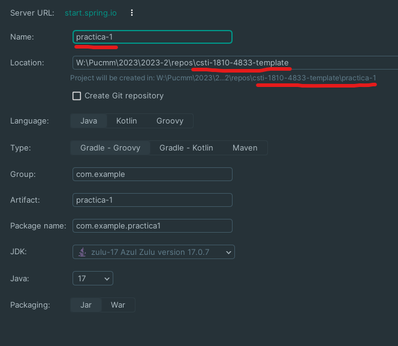
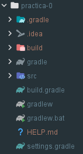

# csti-1810-4833-template (Programación Web Avanzada)
Esta es una plantilla para entrega de practicas para que tengan el mismo formato en cuanto a código fuente.

**El directorio "practica-0" es utilizado como prueba para que puedan visualizar como deben de quedar cada proyecto.**

## ¿Como crear un proyecto en una "practica-n"?
### Intellij-IDEA
1. Entrar en la ventana de nuevo proyecto y seguir el siguiente paso:  
2. Asegurarse que el **NOMBRE** del proyecto lleva el mismo nombre de la carpeta en cuestión y que la locación del directorio padre sea la apropiada. 
3. Para asegurarse que está funcionando y se creó de la forma correcta, la siguiente imagen debe de ser el resultado para un proyecto "gradle" de "spring-boot" en la nueva carpeta que corresponde a la práctica en cuestión, en este caso de prueba, "practica-0". 

### Sugerencias
Para cualquier información / directorio / archivo faltante, existe la posibilidad de comunicarse conmigo para poder actualizar la plantilla y así poder tener automatizado ciertas especificaciones para que a la hora de la corrección, puedan tener sus resultados mas rápido.

#### Contacto
**Correo electrónico:** 20130216@ce.pucmm.edu.do

